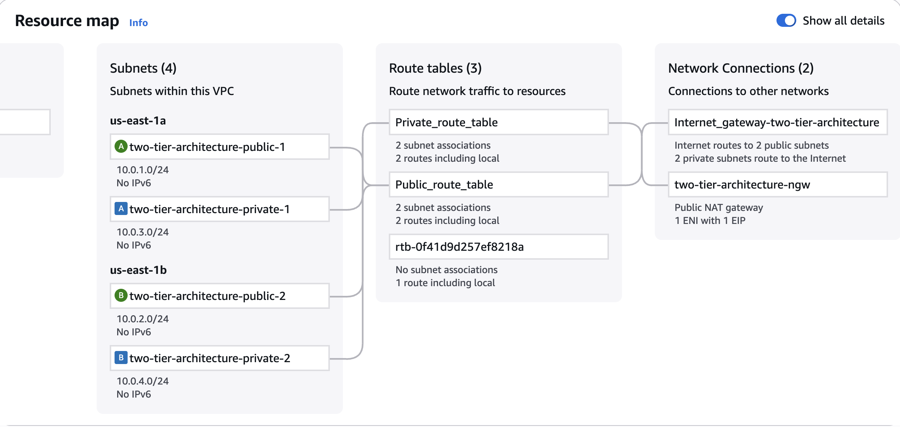
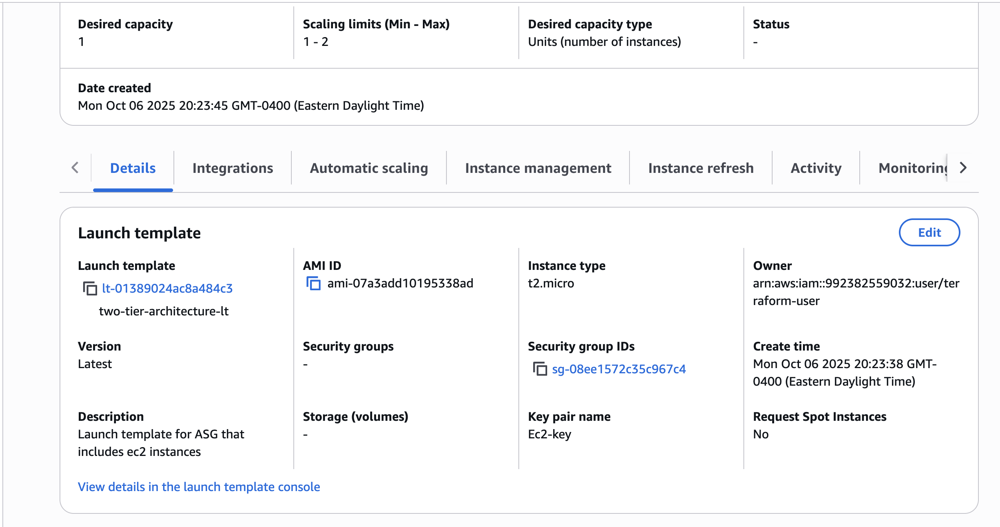
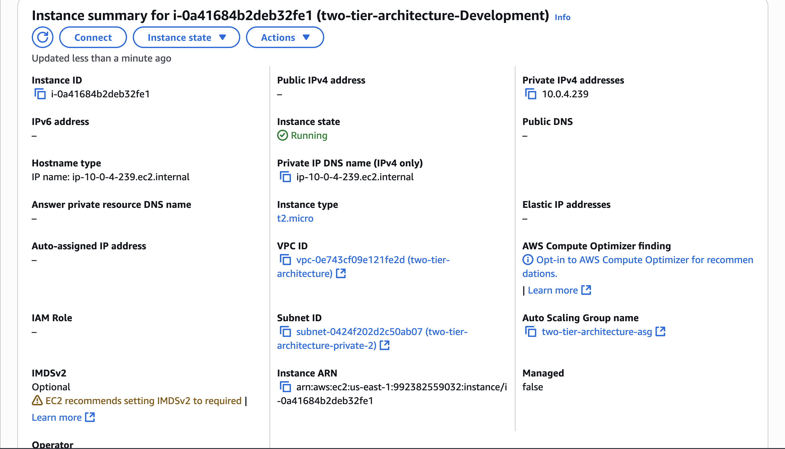
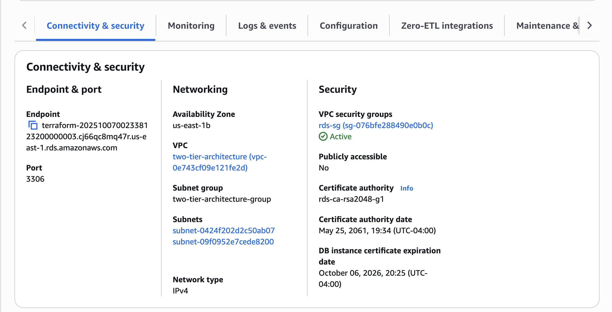
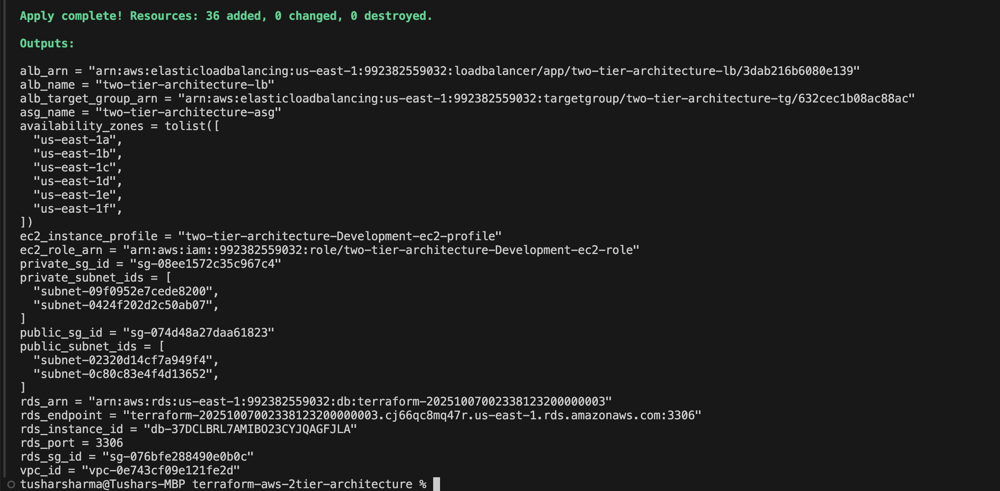
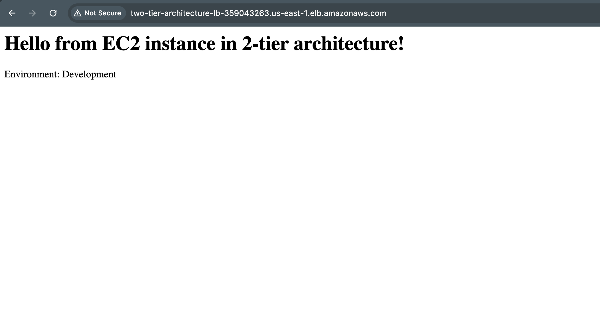

#  Terraform AWS 2-Tier Architecture

This project demonstrates the **deployment of a complete 2-Tier Architecture on AWS** using **Terraform**.  
The infrastructure consists of the following major components:

- **VPC** with public and private subnets (multi-AZ)
- **Security Groups** with proper ingress/egress rules
- **Application Load Balancer (ALB)** in the public subnet
- **Auto Scaling Group (ASG)** in the private subnet with user data
- **RDS MySQL Database** in private subnets
- **IAM roles** for EC2


##  Project Structure

terraform-aws-2tier-architecture/
│

├── modules/

│ ├── vpc/

│ ├── security-group/

│ ├── iam/

│ ├── alb/

│ ├── asg/

│ └── rds/

│
├── screenshots/ # Deployment proof and AWS console screenshots

├── main.tf

├── variables.tf

├── outputs.tf

├── provider.tf

├── user_data.sh

└── README.md


---

##  Step 1: Bootstrap Repository (S3 + DynamoDB)

> This project depends on a **separate GitHub repository** for bootstrapping the **remote backend**:  
> [(https://github.com/Tushar-Sharma10/s3-dynamodb-backend.git)]

The bootstrap repository creates:

- An **S3 bucket** → to store Terraform state files  
- A **DynamoDB table** → for state locking

Make sure you have already applied the bootstrap repository before running this project.

---

##  Step 2: Deploy the 2-Tier Architecture

After the backend is configured via the bootstrap repo, run the following commands in this repository:

```bash
terraform init
terraform plan -out=tfplan
terraform apply "tfplan"
```

 Step 3: Validate Deployment

- Visit the Application Load Balancer DNS output to check the web application.

- Confirm that EC2 instances in the private subnet are launched successfully via the ASG.

- Verify RDS in the AWS Console → RDS → Databases.

- Check security group rules to ensure correct traffic flow between tiers.

Important: Cost Warning

Note: This project will create real AWS resources.
Running this infrastructure for a long time can incur charges (especially RDS and Load Balancer).
It is recommended to destroy all resources after testing:

- terraform destroy -auto-approve

## Screenshots

All relevant AWS console screenshots are in the [`/screenshots`](./screenshots) folder. Here are a few highlights:

### Resource Map


### Launch Template


### Ec2 Instance


### RDS Database


### Terraform Outputs


### Web Instance Verification

